## How to set up XDebug in VS Code

1. First of all you need to install "PHP Debug" extension for VS Code.

    Go to extensions -> type "PHP Debug" -> Install

1. Set up debugger in VS Code (`launch.json`). Config should look like this:

```json
{
    "version": "0.2.0",
    "configurations": [
        {
            "name": "Listen for XDebug",
            "type": "php",
            "request": "launch",
            "log": true,
            "port": 9001,
            "pathMappings": {
                "/app": "${workspaceRoot}/api"
            },
            "xdebugSettings": {
                "max_data": 65535,
                "show_hidden": 1,
                "max_children": 100,
                "max_depth": 5
            }
        }
    ]
}
```
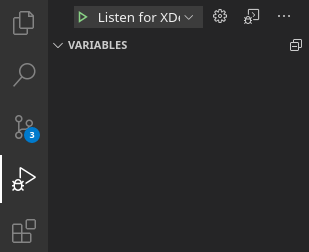

3. Start application:

```bash
docker-compose up -d
```

4. Run debugger:

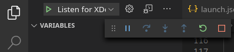

5. Set breakpoint in the editor and make a request:

```bash
curl http://localhost:8000/api/status
```

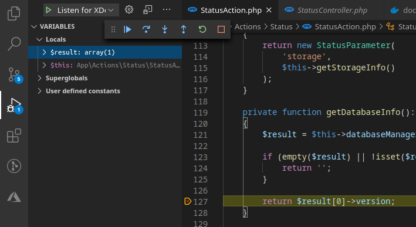

### Troubleshooting

If the default configuration is not working, check `xdebug.log` first. Probably, you will need to set up different `remote_host` value for your configuration. Stop the application:

```bash
docker-compose down
```

Create `docker-compose.override.yml` file, copy `XDEBUG_CONFIG` value from `docker-compose.yml`, and change the `remote_host` value to your host. The configuration should look like this:

```yml
version: '3'
services:
  app:
    environment:
      XDEBUG_CONFIG: "remote_host=172.17.0.1 remote_port=9001 remote_log=/app/xdebug.log"

```

Start the application again:

```bash
docker-compose up -d
```

## How to set up XDebug in PHPStorm

1. Setup remote CLI interpreter in settings

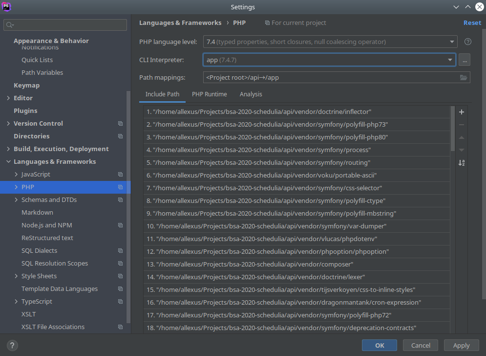

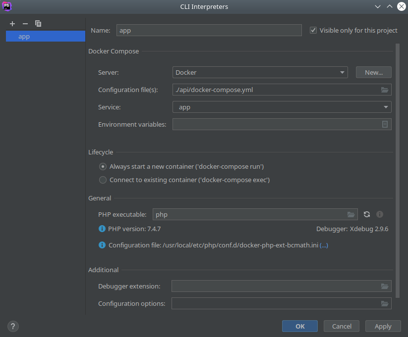

2. Add a new server and configure folder mappings

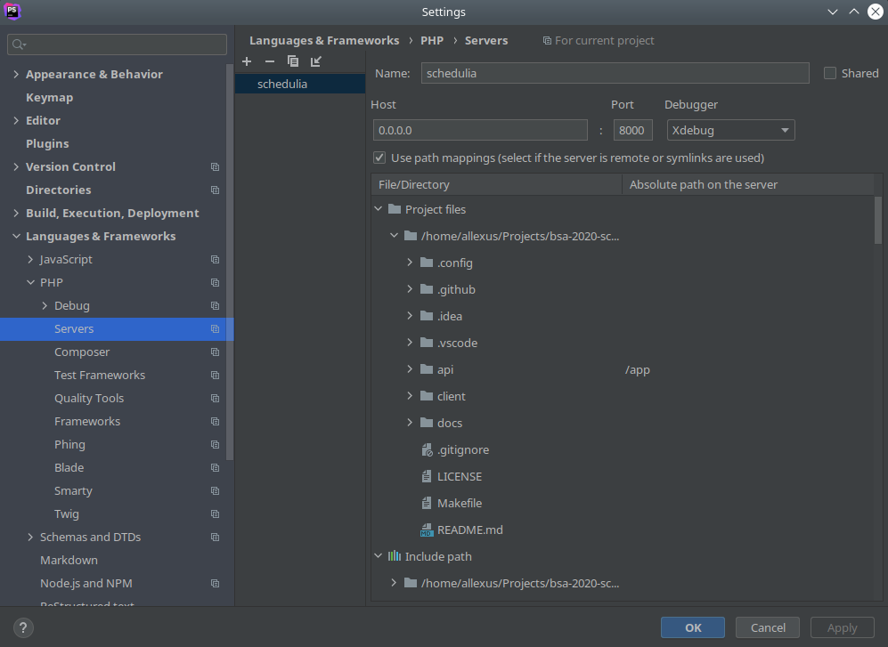

3. Configure debug port

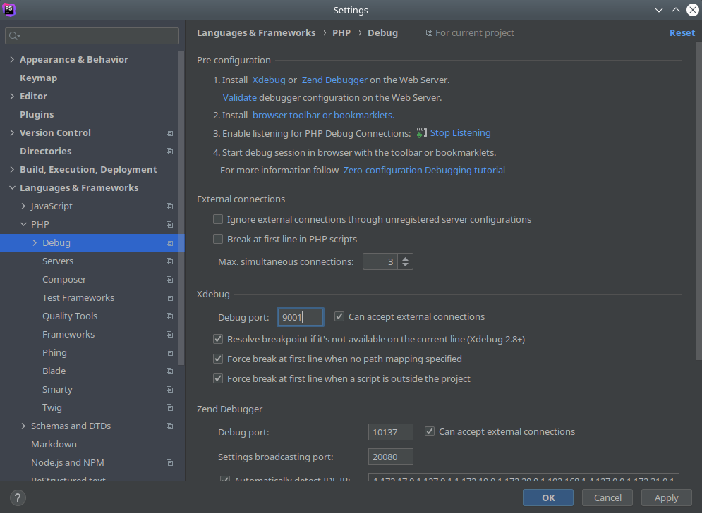

4. Add remote debug configuration

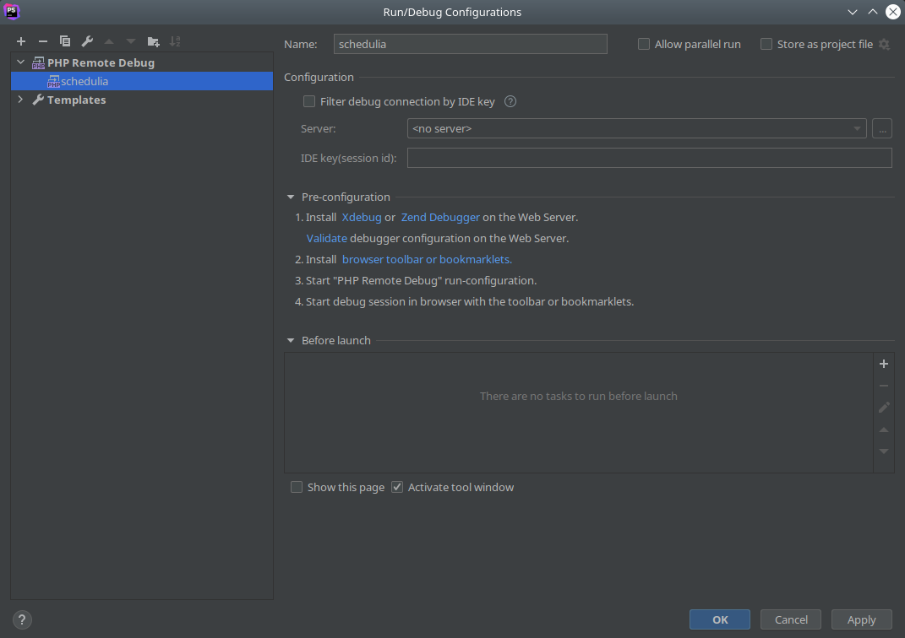

5. Set breakpoint

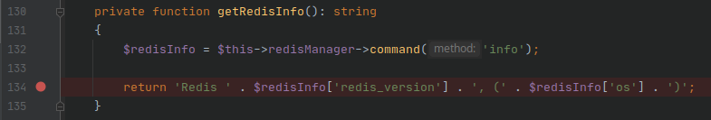

7. Start listening for connections

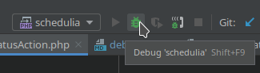

8. Make a request

```bash
curl http://localhost:8000/api/status
```

9. Debug
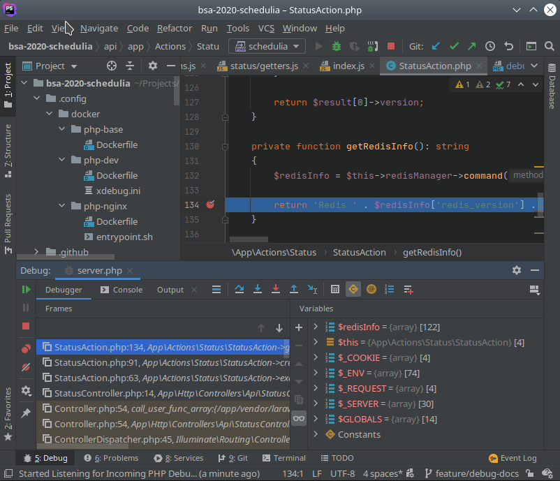
